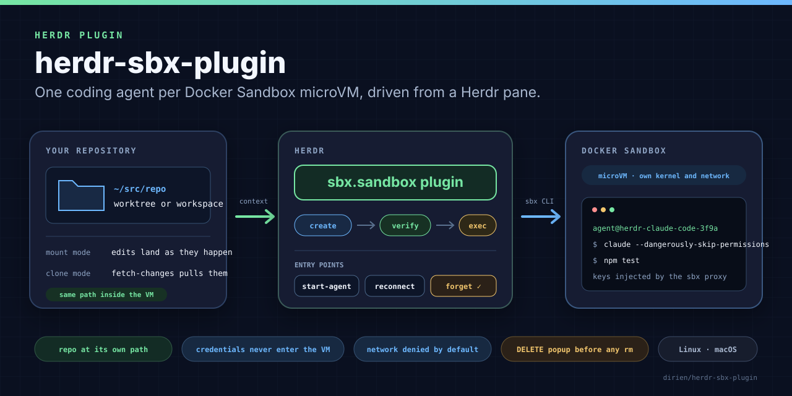

# herdr-sbx-plugin

One coding agent per Docker Sandbox, driven from Herdr.

[](https://herdr.dev/plugins)
[](https://herdr.dev/docs/plugins/)

[](LICENSE)
[](https://github.com/dirien/herdr-sbx-plugin/actions/workflows/ci.yml)



This [Herdr](https://herdr.dev) plugin starts Claude Code, Codex, Gemini CLI,
OpenCode, Copilot CLI or Cursor Agent inside a
[Docker Sandbox](https://docs.docker.com/ai/sandboxes/), a microVM with its
own kernel, filesystem and network policy, and gives it a Herdr pane on your
side. Herdr keeps its status detection and key bindings, `sbx` does the
isolation, and the plugin is the thin layer between the two.

Your repository is mounted into the VM at its own path, so the agent's edits
land in your checkout as they happen. Credentials never enter the VM: `sbx`
injects them through a proxy on the way out. Outbound traffic is blocked unless
you allow it.

> **Boundary:** Linux or macOS, with `sbx` installed and signed in on the same
> machine as Herdr. Verified with Herdr 0.9.0 and sbx 0.42.1 on macOS. There
> is no Windows support, because the command typed into a pane assumes a
> POSIX or fish shell.

## Requirements

| | |
| --- | --- |
| [Herdr](https://herdr.dev) | 0.9.0 or newer (`min_herdr_version` in the manifest) |
| [Docker Sandboxes](https://docs.docker.com/ai/sandboxes/install/) | `sbx` 0.42 or newer, signed in with `sbx login` |
| Node.js | 20 or newer; the plugin has no dependencies to install, and its only build step records where `node` lives |
| Platform | Linux with KVM, or macOS on Apple silicon (what `sbx` needs) |

Install `sbx` with `brew trust docker/tap && brew install docker/tap/sbx` on
macOS, or the `docker-sbx` apt package on Ubuntu. Then sign in and pick the
network preset once. `sbx` would otherwise ask for it interactively before the
first sandbox, and the plugin creates sandboxes from a process that cannot
answer:

```bash
sbx login
sbx policy init balanced   # or allow-all / deny-all
```

Herdr ships everything else.

## Install

```bash
herdr plugin install dirien/herdr-sbx-plugin
```

Herdr clones the repository and runs the manifest's build step,
`scripts/write-node-path.sh`, which records where your `node` lives. Pin a
release instead of the default branch with `--ref v0.1.0`, and pass `--yes` to
skip the confirmation prompt.

Verify what got registered and that `sbx` answers:

```bash
herdr plugin action list --plugin sbx.sandbox         # fourteen actions
herdr plugin action invoke doctor --plugin sbx.sandbox
herdr plugin log list --plugin sbx.sandbox --limit 1  # "ok":true in the first stdout line
```

For local development, link a checkout. `herdr plugin link` does not run the
build step, so record the node path yourself:

```bash
git clone https://github.com/dirien/herdr-sbx-plugin.git
cd herdr-sbx-plugin && sh scripts/write-node-path.sh
herdr plugin link "$PWD"
```

## First run

1. Give the agent a credential. `sbx` keeps it outside the VM and injects it
   per request, and the `balanced` preset already allows the model provider
   APIs. Skip this if you sign in to Claude interactively; the agent then asks
   on its first start.

   ```bash
   echo "$ANTHROPIC_API_KEY" | sbx secret set anthropic
   ```

2. Add the key bindings. This appends four `[[keys.command]]` entries to
   Herdr's `config.toml` and reloads it, skipping entries that already exist:

   ```bash
   herdr plugin action invoke install-keybindings --plugin sbx.sandbox
   ```

3. Open Herdr in a project and press `ctrl+b`, release, then `shift+a`. A pane
   named `sbx claude-code <id>` appears, prints `Creating Docker Sandbox
   herdr-claude-code-<id> for /your/project (agent claude, mount mode)...`, and
   Claude Code starts once the VM is up. Herdr shows it as working, blocked or
   idle like any local agent.

4. When you leave the agent, the pane shows its exit code. Press `ctrl+b`,
   `shift+b` in that pane to bring it back into the same sandbox, or
   `ctrl+b`, `shift+s` for a shell inside the VM.

That is the whole loop. The rest of this document is reference.

## Actions

Every action is an entry point Herdr can bind or invoke; `herdr plugin action
invoke <action> --plugin sbx.sandbox` runs one from any host terminal, and
`sh scripts/run-action.sh <action>` does the same and waits for the result.

| Action | Context | What it does |
| --- | --- | --- |
| `doctor` | global, workspace, pane | Runs `sbx version` and `sbx daemon status`, prints the plugin's directories. Creates nothing. |
| `install-keybindings` | global, workspace, pane | Appends the four key bindings listed below to Herdr's `config.toml` when they are missing, then reloads the config. |
| `start-agent` | workspace, pane | Creates a sandbox for the current worktree, opens a pane, launches the configured agent. |
| `reconnect` | pane | Launches the mapped agent again in its sandbox, creating the sandbox first if it was never prepared. |
| `open-shell` | pane | Splits a pane below the one you are in and opens a login shell inside the sandbox. |
| `fetch-changes` | pane | Brings a clone-mode sandbox's branches into the host repository as `sandbox-<name>/<branch>` refs. |
| `stop` | pane | `sbx stop`. The filesystem is kept. |
| `info` | pane | Prints the mapping, the resolved agent command, the live sandbox status and published ports. |
| `list-sandboxes` | global, workspace, pane | Lists every mapping and flags sandboxes or panes that no longer exist. |
| `prune-mappings` | global, workspace, pane | Drops mappings whose pane is gone and whose sandbox `sbx` no longer lists, then offers to delete sandboxes that still exist but lost their pane (popup, type DELETE). |
| `sandboxes` | global, workspace, pane | Opens a live overlay of every sandbox: pane, agent, state, status, ports. `q` closes it. |
| `open-port` | pane | Opens `http://localhost:<port>` for the focused sandbox's first published port, or for a Ctrl-clicked `sbx://<sandbox>/<port>` link. |
| `replace-sandbox` | pane | Popup confirmation, `sbx rm --force`, then a fresh sandbox in the same pane. |
| `forget-mapping` | pane | Popup confirmation, `sbx rm --force`, and the mapping is dropped. |

Pane actions use the focused pane. When that pane has no sandbox but the
workspace has exactly one, the plugin uses that one, so running an action from
the pane next to the agent works. When the mapped pane no longer exists, for
example after a Herdr restart, `reconnect` and `replace-sandbox` open a new
pane next to you and move the sandbox there (`adoptedFrom` in the result), and
`list-sandboxes` marks such mappings with `pane gone`. When a pane exists but
swallows the typed command, for example because it is not at a shell prompt,
`reconnect` and `replace-sandbox` start in a fresh pane after four seconds
instead (`movedTo`) and relabel the old one `(moved to ...)`. `reconnect`,
`replace-sandbox` and `forget-mapping` refuse to run while Herdr still detects
an agent in the target pane, and so does `stop`, because `sbx stop` kills an
attached session outright.

## Key bindings

Herdr has no menu for plugin actions; they run from a key binding or the CLI.
The `install-keybindings` action, or `scripts/install-keybindings.sh` from a
checkout, appends these entries to Herdr's `config.toml` and then runs
`herdr config check` and `herdr server reload-config`:

| Chord | Action |
| --- | --- |
| `prefix+shift+a` | `start-agent` |
| `prefix+shift+b` | `reconnect` |
| `prefix+shift+s` | `open-shell` |
| `prefix+shift+o` | `sandboxes` |

Each entry looks like this:

```toml
[[keys.command]]
key = "prefix+shift+a"
type = "plugin_action"
command = "sbx.sandbox.start-agent"
description = "start an agent in a Docker Sandbox"
```

Those four chords are unused by Herdr 0.9. `prefix+shift+d` and
`prefix+shift+r` look tempting but close the workspace and reload the config,
so the installer leaves an existing binding on such a chord alone and reports
it instead of replacing it. A chord that another command already uses is
reported the same way and not taken. If `herdr config check` rejects the
result, the file is restored from a backup and the action fails with `config`.
Bind other actions the same way, then run `herdr config check` and
`herdr server reload-config`. `prefix+?` inside Herdr lists what is active (the
default prefix is `ctrl+b`), and `herdr config reset-keys` removes every custom
binding.

## Configuration

The config file is `config.json` in the directory printed by
`herdr plugin config-dir sbx.sandbox`. The plugin rejects unknown keys, so a
typo fails loudly instead of silently using a default.

```json
{
  "agentKind": "claude-code",
  "agentArgs": { "claude-code": ["--dangerously-skip-permissions", "--model", "opus"] },
  "workspaceMode": "mount",
  "kits": ["ghcr.io/example/my-kit:latest"],
  "env": ["CI=1"],
  "publish": ["3000"],
  "memory": "8g"
}
```

| Key | Default | Meaning |
| --- | --- | --- |
| `agentKind` | `"claude-code"` | Which adapter to launch. Built-in kinds are listed below; custom kinds come from `customAgents`. |
| `agentArgs` | `{}` | Per-kind argument list that replaces the adapter's default arguments entirely. |
| `agentEnv` | `[]` | `KEY=VALUE` entries passed to `sbx exec --env` when the agent starts. |
| `customAgents` | `{}` | Extra adapters, see below. |
| `workspaceMode` | `"mount"` | `mount` bind-mounts the worktree read-write; `clone` gives the agent a private git clone. |
| `template` | `null` | Image passed to `sbx create --template`; by default `sbx` picks the agent's template. |
| `kits` | `[]` | Kit references passed as repeated `--kit` flags. |
| `kitArgs` | `[]` | `name=value` entries passed as `--kit-arg`. |
| `env` | `[]` | `KEY=VALUE` or bare `KEY` entries passed to `sbx create --env`. Keep API keys out of it; see credentials below. |
| `envFiles` | `[]` | Files passed to `sbx create --env-file`. |
| `publish` | `[]` | Port specs passed to `sbx create --publish`, for example `"8080:3000"`. |
| `cpus` | `null` | `--cpus` for the VM. |
| `memory` | `null` | `--memory` for the VM, for example `"8g"`. |
| `denyNetwork` | `[]` | Per-sandbox deny rules passed to `--deny-network`. |
| `extraWorkspaces` | `[]` | Additional paths mounted next to the worktree, for example `"/data/fixtures:ro"`. |
| `sbxBin` | `null` | Path to the `sbx` executable. Falls back to `HERDR_SBX_BIN`, then `sbx` on `PATH`. |
| `shell` | `"bash"` | Shell used inside the sandbox for setup scripts and `open-shell`. |
| `paneDirection` | `"right"` | Where `start-agent` splits: `right` or `down`. |
| `paneRatio` | `0.5` | Split ratio between 0 and 1 for `start-agent`; `open-shell` always splits in half. |
| `openIn` | `"split"` | Where `start-agent` puts the agent: a `split` next to the focused pane, or a new `tab` in the workspace. |
| `reportAgentStatus` | `true` | Announce agents without a `herdrDetectionKind` to Herdr through `pane report-agent` while they run. |
| `sandboxNamePrefix` | `"herdr"` | Sandbox names look like `<prefix>-<agentKind>-<12 hex chars>`. |
| `cleanupOnWorktreeRemoved` | `true` | Offer to delete the sandboxes of a worktree when Herdr removes it (popup, type DELETE); declining keeps them for `prune-mappings`. |

### Agents

| `agentKind` | `sbx` agent | Command inside the sandbox | `HERDR_AGENT` |
| --- | --- | --- | --- |
| `claude-code` | `claude` | `claude --dangerously-skip-permissions` | `claude` |
| `codex` | `codex` | `codex --dangerously-bypass-approvals-and-sandbox` | `codex` |
| `gemini` | `gemini` | `gemini --yolo` | `gemini` |
| `opencode` | `opencode` | `opencode` | `opencode` |
| `copilot` | `copilot` | `copilot --yolo` | `copilot` |
| `cursor` | `cursor` | `cursor-agent --yolo` | `cursor` |

The default arguments are the ones the Docker templates use for `sbx run`. The
VM is the guardrail, which is why the agents run without permission prompts.
Set `agentArgs` if you want prompts back.

The pane command carries `HERDR_AGENT=<kind>` so Herdr's screen detection knows
which agent is running behind the remote TTY. A custom agent describes which
`sbx` agent (or sandbox kit reference) to create, what to run, and optionally
a setup script that runs the first time the plugin prepares a sandbox:

```json
{
  "agentKind": "aider",
  "customAgents": {
    "aider": {
      "title": "Aider",
      "sbxAgent": "shell",
      "command": ["aider"],
      "defaultArgs": ["--yes"],
      "herdrDetectionKind": null,
      "setupScript": "pipx install aider-chat"
    }
  }
}
```

`herdrDetectionKind` must be a label Herdr knows (`claude`, `codex`, `gemini`,
`opencode`, `copilot`, `cursor`, ...). Leave it `null` for agents Herdr cannot
detect yet. For those the bridge tells Herdr which agent owns the pane through
`pane report-agent` while it runs and releases it when it exits, so Herdr shows
the agent and the plugin's own guards work. Herdr still cannot tell whether
such an agent is working or waiting; set `reportAgentStatus` to `false` to
turn the announcement off.

### Which directory gets mounted

The workspace's worktree checkout, or the workspace directory, or the git
repository containing the focused pane's directory, or that directory itself
when it is not inside a repository. The pane's own directory only decides
where the agent starts: if you were in `repo/packages/api`, the whole
repository is mounted and the agent opens in `packages/api`. The plugin refuses
to mount your home directory or `/`. `start-agent` names the new pane
`sbx <agentKind> <short id>` and shows a Herdr toast; if a sandbox with that
name already exists, the bridge reuses it.

### Workspace modes

Mount mode, the default, bind-mounts the worktree read-write at the same
absolute path inside the VM. There is nothing to sync: `git status` on the host
shows the agent's edits as they happen.

Clone mode passes `--clone` to `sbx create`. The agent works on a private
clone inside the VM; the host checkout is mounted read-only at
`/run/sandbox/source`. The clone sits at the same absolute path as the host
checkout (verified with sbx 0.42.1), so the plugin passes no working directory
in this mode. Run `fetch-changes` to pull the agent's commits into the host
repository as `sandbox-<name>/<branch>` refs, then merge or cherry-pick as
usual. `sbx` registers a `sandbox-<name>` git remote only while `sbx run` is
attached and stops a sandbox once its last session ends, so `fetch-changes`
tries that remote only while the sandbox is running. Otherwise, when the
remote is absent, or when it does not answer, it carries the branches over in
a git bundle through `sbx exec` and `sbx cp`, which also starts a stopped
sandbox (`transport` in the result says which path was used). The fetched
refs disappear with the sandbox, so keep work before `forget-mapping` or
`replace-sandbox` with `git branch agent-work sandbox-<name>/agent-work`;
`fetch-changes` prints that command for each branch.

### Credentials and network

The plugin never reads or stores tokens itself. The `env`, `envFiles` and
`agentEnv` keys do forward host values into the VM, so keep API keys out of
them and register them with `sbx` instead; the proxy injects them per request:

```bash
echo "$ANTHROPIC_API_KEY" | sbx secret set anthropic
sbx secret set github --command 'gh auth token'
sbx policy allow network registry.npmjs.org,api.github.com
```

The network preset you chose with `sbx policy init` decides what the VM may
reach: `balanced` allows model provider APIs, package registries and code
hosts and blocks the rest, `deny-all` blocks everything until you allow it. If
an agent needs another host, allow it with `sbx policy allow network`, bake
the rule into a kit, or add `denyNetwork` rules for hosts that must stay
unreachable.

### Ports and the overlay

Publish ports with the `publish` config key or `sbx ports <name> --publish`.
`info` and the `sandboxes` overlay print each one as an `sbx://<sandbox>/<port>`
link; Ctrl-click it in Herdr and the plugin opens `http://localhost:<host port>`
with `open` on macOS or `xdg-open` elsewhere (override with `HERDR_SBX_OPENER`).
The opener runs detached: one that exits with an error within two seconds makes
the result report `"opened":false`, while one still running then (a browser
started in the foreground) counts as showing the page and is not waited for.
Links only work for sandboxes this plugin created and ports `sbx` reports as
published, so text printed by an agent cannot steer your browser to another
local service. The overlay refreshes every few seconds, keeps working while a
command hangs, and closes on `q`.

## Driving the plugin from scripts

Every action prints one line first:

```text
HERDR_SANDBOX_RESULT: {"schemaVersion":1,"plugin":"sbx.sandbox","action":"start-agent","ok":true,"paneId":"ws:1:3","sandboxName":"herdr-claude-code-3f9a1c0b2d4e",...}
```

Invoke an action and read the line back from the command log:

```bash
herdr plugin action invoke start-agent --plugin sbx.sandbox
herdr plugin log list --plugin sbx.sandbox --limit 1
```

`invoke` returns as soon as Herdr has started the action, so the log entry may
still say `running` for a moment, or for as long as a deletion popup waits for
its answer. `scripts/run-action.sh` does the waiting for you: it invokes the
action, polls the log, prints the result line plus the action's stderr, and
exits 0 when `ok` is true.

```bash
sh scripts/run-action.sh info
sh scripts/run-action.sh forget-mapping 120   # answer the popup in Herdr meanwhile
```

Besides `schemaVersion`, `plugin`, `action` and `ok`, a successful line
carries these fields:

| Action | Fields |
| --- | --- |
| `doctor` | `sbxBin`, `node`, `pluginRoot`, `stateDir`, `configDir`, `version`, `versionWarning`, `daemon`, `agentKind`, `workspaceMode`, `template` |
| `install-keybindings` | `configPath`, `added` and `existing` (each entry has `key` and `action`), `warnings`, `reloaded` |
| `start-agent` | `paneId`, `sourcePaneId`, `sandboxName`, `agentKind`, `localPath`, `workdir`, `workspaceMode`, `openIn`, `previousSandboxNames` |
| `reconnect` | `paneId`, `sandboxName`, `agentKind`, `mode` (`connect`, or `start` when the sandbox still has to be prepared or the bridge was moved), `adoptedFrom` (the old pane id when a mapping whose pane was gone got a new one), `movedTo` (the new pane id when a live pane swallowed the typed command) |
| `open-shell` | `paneId` (the shell pane), `mappedPaneId`, `sandboxName` |
| `fetch-changes` | `paneId`, `remote`, `transport` (`remote` or `bundle`), `branches`, `keep` (one entry per fetched ref whose commits the host does not reach yet: `ref`, `local`, `reason`, and the `git branch` `command`; a host branch of the same name gets a `-sandbox` suffix) |
| `stop` | `paneId`, `sandboxName` |
| `info` | `paneId`, `mapping`, `agent`, `gitRemote`, `sandbox`, `sandboxError`, `ports`, `portsError` |
| `prune-mappings` | `pruned`, `kept` (each with `paneId`, `sandboxName`, and a `reason` for kept ones), `deleted`, `failures` (deletions that failed after DELETE, each with `errorKind` and `message`), `orphansConfirmed` |
| `sandboxes` | `entrypoint` |
| `open-port` | `sandboxName`, `sandboxPort`, `hostPort`, `url`, `opened`, `opener` |
| `list-sandboxes` | `mappings` (each with `paneId`, `paneExists` (`null` with a `paneError` when Herdr could not list its panes), `sandboxName`, `agentKind`, `localPath`, `workdir`, `workspaceMode`, `lifecycleState`, `exists`, `status`), `sandboxError` |
| `replace-sandbox` | `paneId`, `sandboxName`, `agentKind`, `deleted`, `alreadyMissing`, `movedTo` |
| `forget-mapping` | `paneId`, `sandboxName`, `deleted`, `alreadyMissing` |

Failures carry `"ok": false`, an `errorKind`, a `message`, and the captured
CLI `output` trimmed to 4000 characters when there was any:

| `errorKind` | Meaning |
| --- | --- |
| `not-found` | The sandbox no longer exists, or for `fetch-changes` the mounted directory is not a git repository. `stop` and a failed attach mark the mapping `missing`. |
| `daemon` | `sandboxd` is not running or unreachable, or a captured `sbx` call was killed after its timeout. |
| `authentication` | `sbx` wants you to run `sbx login`. |
| `conflict` | The bridge process for the mapping is still running (preparing the sandbox or attached to the agent), an `open-shell` session is attached, Herdr still detects an agent in the pane, another action is deleting the mapping's sandboxes right now, `sbx` reported a name clash, or a mapping changed while a confirmation popup was open. |
| `network` | Classified from the `sbx` output, or `git fetch` could not reach the sandbox remote. |
| `permission` | Classified from the `sbx` output. |
| `cancelled` | The confirmation popup was declined, interrupted or timed out. |
| `config` | `config.json` or a custom agent is invalid, the agent binary is missing in the VM, or `herdr config check` rejected the config while installing key bindings. |
| `target` | No usable pane, worktree or mapping in the invocation context, a path the pane shell cannot quote, or an action that does not apply to the mapping's mode or state. |
| `startup` | The plugin itself could not run (missing `sbx`, missing Herdr directories, unreadable state). |
| `unknown` | Anything else; the captured CLI output is included. |

Set `HERDR_SBX_CONFIRMATION_TIMEOUT_MS` to shorten the 60 second confirmation
window when testing orchestration, and `HERDR_SBX_LOCK_WAIT_MS` to shorten the
five seconds an action waits for another process to release a mapping. Captured `sbx` calls are killed after two
minutes and reported as `daemon` failures, so a wedged daemon cannot hang an
action; the host-side `git fetch` of `fetch-changes` has the same limit and
reports a timeout as `network`. `sbx create` and setup scripts get thirty
minutes because the first create pulls an image. `HERDR_SBX_TIMEOUT_MS` and
`HERDR_SBX_SLOW_TIMEOUT_MS` change those limits. The interactive agent session
has no timeout.

## State and cleanup

Mappings live as one JSON file per pane under `panes/` in the plugin's state
directory; `doctor` prints the path. Each file ties a Herdr pane id to a
sandbox name, the mounted directory, the agent kind, and a lifecycle state:
`provisional`, `creating`, `created`, `prepared`, `ready`, `stopped`,
`missing` or `failed`. When Herdr hands out a pane id that still has a
mapping, the old sandbox name is carried over so `forget-mapping` and
`replace-sandbox` delete it too, and every deletion popup lists every sandbox
it will remove. The worktree hook targets the mappings whose mounted directory
is exactly the removed worktree, and asks before deleting like every other
deletion. Confirmation requests for the popup live next to the mappings under
`confirmations/` and are swept automatically.

The plugin's own processes coordinate through the mappings too. A bridge
records its process id while it prepares a sandbox or has the agent attached,
an `open-shell` session does the same, and a deletion claims the mapping
before the first `sbx rm`, so a deletion never runs under a live session and
a session never starts into a deletion. The records name the process and its
start time, so a recycled process id never keeps a mapping busy, and every
change goes through short-lived `.lock` files next to the mappings that are
reclaimed on their own when the process that held them died.

Local Docker Sandboxes have no time-to-live. Every `start-agent` creates a new
sandbox and mapping; `list-sandboxes` shows what the plugin tracks,
`forget-mapping` deletes one sandbox, `prune-mappings` cleans up after removed
sandboxes and closed panes, and `sbx prune` handles sandboxes created outside
the plugin.

## Trust and security

Installing a Herdr plugin runs its commands as your user. Review
[`herdr-plugin.toml`](herdr-plugin.toml) and the source before installing code
you do not trust; this plugin runs `node`, `sbx`, `herdr` and `git`, nothing
else.

The sandbox boundary belongs to Docker Sandboxes, not to this plugin. What the
plugin adds on top: it never runs a shell string built from repository content
(every `sbx`, `herdr` and `git` call is a direct argv), it quotes the one
command it types into your pane, it never runs a destructive `sbx` command
without the DELETE popup, and it opens browser links only for sandboxes it
created and ports `sbx` reports as published. In mount mode the agent has
read-write access to your checkout and runs with permission prompts disabled;
use clone mode when that is more than you want to hand it.

## Troubleshooting

- `doctor` fails with `startup`: `sbx` is not on the `PATH` Herdr started
  with. Set `sbxBin` in `config.json`.
- `doctor` fails with `daemon`: run `sbx daemon start` or `sbx diagnose`.
- Creating the first sandbox fails and the output mentions the network policy
  or a preset: run `sbx policy init balanced` once. `sbx` asks for the preset
  interactively before its first sandbox, and the plugin cannot answer for you.
- A plugin action fails with "node was not found": run
  `sh scripts/write-node-path.sh` in the plugin directory, or set
  `HERDR_SBX_NODE` to your node binary in Herdr's environment. The manifest
  starts every command through `bin/run.sh`, which prefers that recorded path.
- The agent exits immediately: run `open-shell` and start the agent by hand
  to see its error. Common causes are a missing credential (`sbx secret ls`)
  or a blocked host (`sbx policy log`).
- The pane shows `not available inside sandbox`: the template does not put
  the agent binary on `PATH`. Set `template`, add a `setupScript`, or pick
  another kind.
- Herdr does not show the agent's status: the launch command must carry
  `HERDR_AGENT`; check `info` for the resolved `herdrDetectionKind`.
- To reproduce a failure by hand, run the command the pane runs:
  `node src/bridge.mjs start --state-dir <state dir> --config-dir <config dir> --pane-id <pane id>`
  from the plugin directory; `doctor` prints both directories.

## Development

```bash
npm run check   # syntax check every module, then run the tests
npm test
```

The tests run the real scripts as child processes against fake `sbx` and
`herdr` executables in `test/fakes/`, so they need no Docker and no Herdr, only
`git`. `docs/manual-testing.md` is the checklist for a machine that has both.

| Path | Purpose |
| --- | --- |
| `herdr-plugin.toml` | Manifest: actions, the `worktree.removed` hook, the popup and overlay panes, the port link handler |
| `bin/run.sh`, `scripts/write-node-path.sh` | Node shim and the build step that records the path of a Node 20+ binary |
| `scripts/install-keybindings.sh` | Adds key bindings to the Herdr config and reloads it; the `install-keybindings` action runs it |
| `scripts/run-action.sh` | Invokes an action from a terminal and waits for its result line |
| `src/action.mjs` | Entry point that always prints the result marker |
| `src/action-main.mjs` | Action handlers |
| `src/context.mjs` | Herdr environment, invocation context, mount root rules |
| `src/result.mjs`, `src/errors.mjs` | Result line and error kinds |
| `src/naming.mjs`, `src/shell.mjs`, `src/constants.mjs` | Sandbox names, pane command quoting, constants |
| `src/bridge.mjs`, `src/bridge-main.mjs` | Runs in the pane: create, verify, attach |
| `src/events.mjs`, `src/events-main.mjs` | The `worktree.removed` hook |
| `src/deletion-confirmation.mjs`, `src/confirmation-pane.mjs` | The popup |
| `src/sandboxes-pane.mjs`, `src/sandboxes-pane-main.mjs` | The overlay |
| `src/links.mjs`, `src/open.mjs` | `sbx://` port links and the browser opener |
| `src/lifecycle.mjs` | Shared sandbox operations |
| `src/sbx.mjs`, `src/herdr.mjs` | CLI wrappers and failure classification |
| `src/agents.mjs` | Built-in adapters and custom agent validation |
| `src/state.mjs`, `src/config.mjs`, `src/confirm.mjs` | Mapping store, config, popup handshake |
| `docs/design.md` | Why it is built this way |

## Status

The current release is `v0.1.0`, matching the version in `package.json` and
the plugin manifest. Pin to it with `--ref v0.1.0`; an install without
`--ref` follows the default branch.

Verified on a real host with Herdr 0.9.0 and sbx 0.42.1 on macOS: create,
reconnect, shell, stop, replace, forget, the worktree hook, clone mode with
`fetch-changes`, the overlay and the `sbx ls --json` shape. Still unverified:
the exact wording of `sbx` errors; the failure classifier matches phrases such
as `not found`, `not logged in` and `daemon`, and anything else lands in
`unknown` with the output attached. `sbx ls --json` and `sbx ports --json`
have no documented schema; the parsers accept the shapes seen so far and
report anything else as an error rather than treating it as an empty list.

## License

Apache-2.0. See [LICENSE](LICENSE).
